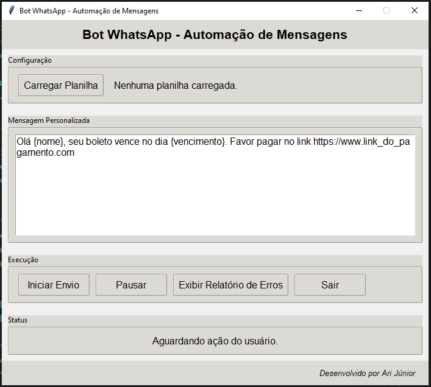

# Bot WhatsApp - Automação de Mensagens

Este é um programa para envio automatizado de mensagens pelo WhatsApp Web. Ele permite carregar uma planilha com os contatos, personalizar a mensagem e enviar as mensagens de forma automática.

---


## **Funcionalidades**
- Carregar uma planilha Excel (`.xlsx`) com os contatos.
- Personalizar a mensagem com placeholders (`{nome}` e `{vencimento}`).
- Enviar mensagens automaticamente pelo WhatsApp Web.
- Pausar e retomar o envio.
- Gerar um relatório (`erros.csv`) com os contatos que apresentaram erros durante o envio.

---

## **Pré-requisitos**
Antes de usar o programa, certifique-se de que você tem os seguintes itens instalados:
- Python 3.8 ou superior
- As bibliotecas Python necessárias:
  - `openpyxl`
  - `pyautogui`
  - `tkinter` (já incluído no Python em sistemas Windows)
  
Para instalar as dependências, execute:
```bash
pip install openpyxl pyautogui
```

---

## **Como Usar**

### **1. Configuração Inicial**
1. Clone o repositório para o seu computador:
   ```bash
   git clone https://github.com/seu-usuario/bot_whatsapp.git
   cd bot_whatsapp
   ```
2. Certifique-se de que o arquivo `.gitignore` está configurado para ignorar arquivos sensíveis, como a planilha de contatos.

---

### **2. Estrutura da Planilha**
A planilha deve estar no formato `.xlsx` e conter as seguintes colunas:
- **Nome**: Nome do contato.
- **Telefone**: Número de telefone no formato internacional (ex.: `5511999999999`).
- **Vencimento**: Data no formato `DD/MM/AAAA`.

Exemplo:
| Nome       | Telefone       | Vencimento  |
|------------|----------------|-------------|
| João Silva | 5511999999999  | 15/03/2025  |
| Maria Lima | 5511988888888  | 20/03/2025  |

---

### **3. Executando o Programa**
1. Execute o programa:
   ```bash
   python app.py
   ```
2. A interface gráfica será exibida.

---

### **4. Usando a Interface**
#### **Carregar Planilha**
- Clique no botão **"Carregar Planilha"** e selecione o arquivo `.xlsx` com os contatos.

#### **Editar Mensagem**
- No campo **"Mensagem Personalizada"**, edite a mensagem padrão, se necessário.
- Use os placeholders `{nome}` e `{vencimento}` para personalizar a mensagem. Exemplo:
  ```
  Olá {nome}, seu boleto vence no dia {vencimento}. Favor pagar no link https://www.linkdopagamento.com
  ```

#### **Iniciar Envio**
- Clique no botão **"Iniciar Envio"** para começar a enviar as mensagens.
- O programa abrirá o WhatsApp Web no navegador e enviará as mensagens automaticamente.

#### **Pausar/Retomar**
- Clique no botão **"Pausar"** para interromper o envio.
- Clique novamente no botão **"Retomar"** para continuar o envio.

#### **Relatório de Erros**
- Após o envio, se houver erros, um arquivo chamado `erros.csv` será gerado com os contatos que apresentaram problemas.
- Clique no botão **"Exibir Relatório de Erros"** para abrir o arquivo.

#### **Sair**
- Clique no botão **"Sair"** para fechar o programa.

---

### **5. Observações**
- Certifique-se de que o WhatsApp Web está configurado para enviar mensagens ao pressionar **Enter**:
  1. Abra o WhatsApp Web.
  2. Vá em **Configurações > Configurações de Bate-papo**.
  3. Ative a opção **"Enviar mensagens com Enter"**.

- O programa utiliza o navegador padrão do sistema para abrir o WhatsApp Web.

---

## Melhorias Futuras

- Adicionar uma interface gráfica para facilitar o uso.
- Permitir a entrada de outros impostos ou margens diferentes.
- Implementar testes unitários para garantir a confiabilidade dos cálculos.

## Contribuição

Sinta-se à vontade para fazer um fork deste projeto, abrir issues ou pull requests para melhorias e correções.

## Licença

Este projeto está sob a licença MIT. Consulte o arquivo LICENSE para mais detalhes.


## Autor
Este projeto foi desenvolvido por **Ari Junior**

- **LinkedIn:** https://www.linkedin.com/in/arijunior09/
- **GitHub:** https://github.com/AriJunior09
